# 🎮 Rust+ Multi-LED Trigger

<div align="center">

**Transform your Rust+ smart alarms into stunning LED light shows!**

Monitor your Rust base with real-time LED notifications through WLED, Govee, and Philips Hue devices.

[](https://www.python.org/downloads/)
[](#)

[📋 Features](#-features) • [🚀 Quick Start](#-quick-start) • [📖 Setup Guide](SETUP.md) • [🔧 Troubleshooting](#-troubleshooting)

</div>

---

## 📊 Support Status

| LED System | Implementation Status | Supported Features |
|------------|----------------------|-------------------|
| **WLED** | ✅ Fully implemented | On/Off, Color control, Effects (0-255), Presets, Local network control |
| **Govee** | ⚠️ Should be fully supported | On/Off, Color control, Scene presets, Brightness control, Cloud API |
| **Philips Hue** | 🚧 Coming soon | Planned: On/Off, Color control, Brightness control, Bridge integration |

## ✨ Features

### 🌈 **Multi-LED Platform Support**
- **🔥 WLED**: ESP32/ESP8266 controllers with 255+ effects and custom presets
- **📱 Govee**: WiFi smart LEDs with scene presets and cloud API integration  
- **💡 Philips Hue**: Enterprise-grade smart lighting (coming soon)

### ⚡ **Real-Time Automation**
- **Instant Response**: Sub-second LED triggering via Telegram monitoring
- **Smart Triggers**: Doors, turrets, vending machines, cargo ship arrivals
- **Background Operation**: Runs silently while you game

### 🎨 **Rich Control Options**
- **Color Picker**: Visual RGB color selection
- **Effect Library**: Access to hundreds of WLED animations
- **Scene Presets**: One-click Govee mood lighting
- **Brightness Control**: Dynamic intensity adjustment

### 💻 **User-Friendly Interface**
- **Tabbed GUI**: Clean, organized settings management
- **Auto-Discovery**: One-click Govee device detection
- **Live Testing**: Instant LED response verification
- **Persistent Settings**: Automatic configuration saving

## 🎮 How It Works

```mermaid
graph LR
    A[🏠 Rust Base] --> B[📱 Smart Alarm]
    B --> C[🔗 IFTTT]
    C --> D[💬 Telegram Bot]
    D --> E[🖥️ This App]
    E --> F[💡 Your LEDs]
```



1. **🚨 In-Game Event** → Smart alarm triggers (door breach, turret activation, etc.)
2. **⚡ IFTTT Integration** → Rust+ sends notification to IFTTT service
3. **📲 Telegram Relay** → IFTTT forwards message to your Telegram bot
4. **🔍 Real-Time Monitoring** → App detects new messages instantly
5. **🌈 LED Magic** → Configured light action executes immediately!

## 🔌 Supported LED Systems

### WLED
- **Local network control** - Works with ESP32/ESP8266 based LED controllers
- **Effects and presets** - Full access to WLED's built-in effects
- **High performance** - Direct HTTP API calls for minimal latency

### Govee
- **WiFi smart LEDs** - Control Govee devices through their cloud API
- **Scene presets** - Use predefined Govee scenes and DIY modes
- **Color and brightness** - Full RGB color control with brightness adjustment
- **Easy setup** - Auto-discovery of your Govee devices

### Philips Hue (Coming Soon)
- **Smart home integration** - Full Philips Hue ecosystem support
- **Advanced features** - Color, brightness, and entertainment sync

## 📋 Requirements

### 🖥️ **System Requirements**
- **Python 3.7+** (3.9+ recommended)
- **Windows 10/11**, **macOS 10.15+**, or **Linux**
- **Internet connection** for Telegram and Govee cloud API

### 💡 **LED Hardware** (Choose one or more)
| Hardware | Requirements |
|----------|-------------|
| **WLED** | ESP32/ESP8266 controller on local network |
| **Govee** | WiFi smart LEDs with API access |
| **Philips Hue** | Hue bridge and compatible bulbs (coming soon) |

### 📡 **Services & Apps**
- **Telegram account** and bot token
- **IFTTT account** (free tier sufficient)  
- **Rust+ mobile app** with configured smart alarms
- **Govee developer API key** (for Govee users)

## 🚀 Quick Start

### 📦 Installation

```bash
# Clone the repository
git clone https://github.com/yourusername/RustPlusLEDv2.git
cd RustPlusLEDv2

# Install dependencies
pip install -r requirements.txt

# Launch the application
python main.py
```

### ⚙️ Quick Setup

1. **Choose your LED system** (WLED/Govee/Hue)
2. **Configure device settings** in the app
3. **Set up Telegram bot** (see [SETUP.md](SETUP.md))
4. **Create IFTTT integration** 
5. **Test and enjoy!** 🎉

> 📖 **Need help?** Check our comprehensive [Setup Guide](SETUP.md) for detailed instructions.

## 🔧 LED System Setup

### WLED Setup
1. Flash WLED firmware to your ESP32/ESP8266
2. Connect to your WiFi network
3. Note the device's IP address
4. Enter the IP in the WLED settings section

### Govee Setup
1. Create a Govee developer account at https://developer.govee.com/
2. Apply for API access and get your API key
3. In the app, enter your API key and click "Get My Devices"
4. Select your device from the list to auto-fill settings

### Philips Hue Setup (Coming Soon)
Setup instructions will be added when Hue support is implemented.

## 💡 Usage Tips

- **WLED Effect Numbers**: Find WLED effect IDs in your WLED controller's web interface (typically 0-100+)
- **WLED Presets**: Create and save presets in WLED, then use their preset number here
- **Govee Scenes**: Use the scene numbers from your Govee app or let the app discover them
- **Color Picker**: Click "Pick Color" to choose any RGB color visually
- **Multiple Alarms**: Set up different IFTTT applets for different alarm types - they'll all trigger the same action

## 🔧 Troubleshooting

<details>
<summary><strong>🤖 Telegram Connection Issues</strong></summary>

- **"Invalid bot token"** → Verify token from @BotFather
- **"Chat ID not found"** → Start conversation with your bot first
- **"Connection timeout"** → Check internet connection

</details>

<details>
<summary><strong>💡 LED Device Problems</strong></summary>

**WLED:**
- Verify device IP address and network connectivity
- Test manually via web browser: `http://[WLED_IP]`

**Govee:**
- Confirm API key is approved and active
- Ensure device is online in Govee mobile app
- Use "Get My Devices" for auto-detection

</details>

<details>
<summary><strong>⚡ IFTTT Integration</strong></summary>

- Check applet is enabled and properly configured
- Verify Rust+ account connection in IFTTT
- Test trigger manually in IFTTT dashboard

</details>

> 💬 **Still stuck?** Open an [issue](../../issues) with your error message and setup details (e.g. what LEDs).

## 📝 License

This project is licensed under the MIT License - see the [LICENSE](LICENSE) file for details.

## 🤝 Contributing

Contributions are welcome! Please feel free to submit a Pull Request. For major changes, please open an issue first to discuss what you would like to change.

### Development Setup
```bash
# Clone and setup
git clone https://github.com/yourusername/RustPlusLEDv2.git
cd RustPlusLEDv2
pip install -r requirements.txt

# Run in development mode
python main.py
```

## ⭐ Show Your Support

Give a ⭐ if this project helped enhance your Rust gaming experience!

## 📧 Contact

- **Issues**: [GitHub Issues](../../issues)
- **Discussions**: [GitHub Discussions](../../discussions)

---

<div align="center">

**Made with ❤️ for the Rust gaming community**

*Enhance your raids with immersive LED lighting!*

</div>
